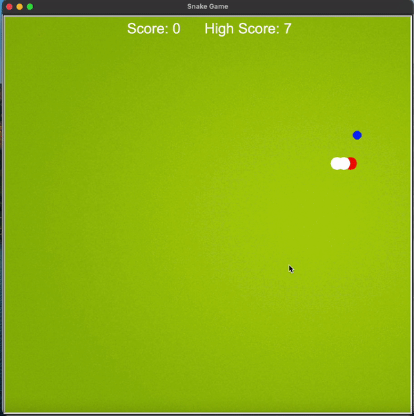

# Disclaimer
These apps and projects are made during the course which i had opted from udemy. Few things are made totally from tutorials help. But in that also i have added new things.

All projects are built from scratch except 1-2 and the initial stage like snake game.
# This repo has 3 parts
- App
  - GUI Application
  - Game
- Automation

## In automation section
I had created various automation like
  - Order product from amazon.
  - sending birthday wishes
  - spotify playlist
  - Stock alert SMS
  - Email motivation quotes
  - weather alert using email  

## There are GUI App like pomodoro, password_organizer and generator etc.

### 1. [Converter Kilometer to Miles](https://github.com/polonium31/python_projects/tree/main/APP/GUI/converter_km_miles)

### 2. [Flash card](https://github.com/polonium31/python_projects/tree/main/APP/GUI/flash_card)

### 3.[Password generator](https://github.com/polonium31/python_projects/tree/main/APP/GUI/password_generator)

### 4.[Pomodoro](https://github.com/polonium31/python_projects/tree/main/APP/GUI/pomodoro)

### 5.[Text/Morse converter](https://github.com/polonium31/python_projects/tree/main/APP/GUI/text_to_morse)

### 6.[Image to color palette](https://github.com/polonium31/python_projects/tree/main/APP/GUI/text_to_morse)

## There are Game like snake, us_states etc.

### 1. [Pong](https://github.com/polonium31/python_projects/tree/main/APP/Game/pong)

### 2.[Snake](https://github.com/polonium31/python_projects/tree/main/APP/Game/snake)

### 3.[US_states](https://github.com/polonium31/python_projects/tree/main/APP/Game/us_states)

